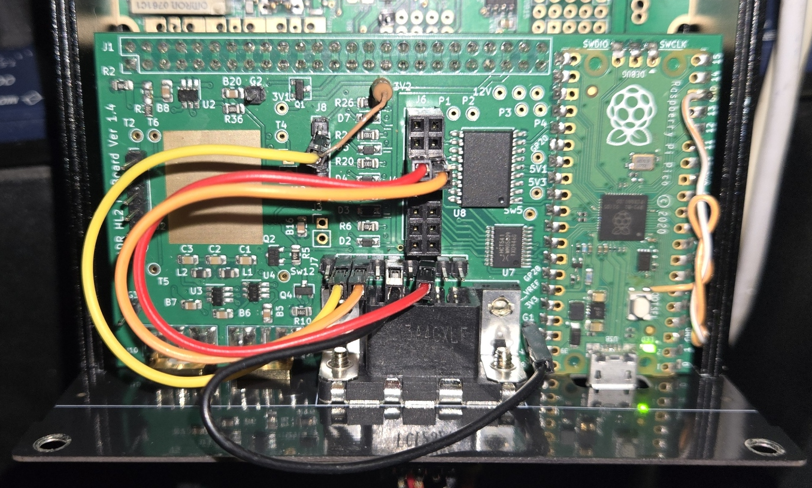

# HL2IOBoard-LDG-AT1000-ProII

LDG AT-1000 Pro II antenna tuner support for Hermes Lite 2 IO Board

## Description

This firmware adds support for the **LDG AT-1000 Pro II** automatic antenna tuner to the [Hermes Lite 2 IO Board](https://github.com/jimahlstrom/HL2IOBoard) designed by Jim Ahlstrom, N2ADR.
It enables control between the Hermes Lite 2 and the tuner radio port for automated tuning cycles.

**Key Features:**
* **LDG Integration:** Control of the LDG AT-1000 Pro II via a modified Icom AH-4 protocol (Requires tuner firmware V1.7).
* **Amplifier Control:** Integrated logic on J6 Out5 to protect both the tuner and the amplifier during tuning.
* **Band Voltage:** Supports Yaesu FT-817 analog band voltage on J4 Out8.
* **BCD Band Decoder:** 4-bit Yaesu-standard BCD output on J6/J4 Out1-4.

This code is based on the original `n2adr_basic` firmware by Jim Ahlstrom N2ADR. BCD band decoding logic inspired by Dalton Williams (W5EIM) is used with original N2ADR logic control.
Only `main.c` and `icom_ah4.c` have been modified.

## 🆕 Update (April 22nd 2026): BCD Band Decoder 
This feature allows the IO Board to drive external Low Pass Filters (LPF) for Solid State Power Amplifiers (SSPA) or automatic antenna switches based on band changes.
* **Standard Yaesu BCD Output:** Outputs 4-bit band data on **J6/J4 Out1-4**. 
    * *Out1 (GPIO16), Out2 (GPIO19), Out3 (GPIO20), Out4 (GPIO11)*.

## BCD Output Logic Table

This table shows the state of **Out 1-4** (available on both J4 & J6) for each band.

| Band | BCD Code (DCBA) | Out 1 (D) | Out 2 (C) | Out 3 (B) | Out 4 (A) |
| :--- | :---: | :---: | :---: | :---: | :---: |
| **160m** | 0001 | 0 | 0 | 0 | **1** |
| **80m** | 0010 | 0 | 0 | **1** | 0 |
| **40m/60m**| 0011 | 0 | 0 | **1** | **1** |
| **30m** | 0100 | 0 | **1** | 0 | 0 |
| **20m** | 0101 | 0 | **1** | 0 | **1** |
| **17m** | 0110 | 0 | **1** | **1** | 0 |
| **15m** | 0111 | 0 | **1** | **1** | **1** |
| **12m** | 1000 | **1** | 0 | 0 | 0 |
| **10m** | 1001 | **1** | 0 | 0 | **1** |
| **6m** (not on HL2) | 1010 | **1** | 0 | **1** | 0 |

#### Pin Mapping Reference

| Signal | J4 (5V Logic) | J6 (Low-side Switch) | Pico GPIO |
| :--- | :--- | :--- | :--- |
| **Data D** | Pin 1 | Pin 1 | GPIO 16 |
| **Data C** | Pin 2 | Pin 2 | GPIO 19 |
| **Data B** | Pin 3 | Pin 3 | GPIO 20 |
| **Data A** | Pin 4 | Pin 4 | GPIO 11 |

> **Operation Logic:**
> * **Logic 1:** J4 outputs **+5V** / J6 switch is **Closed** (Path to GND).
> * **Logic 0:** J4 outputs **0V** / J6 switch is **Open**.

## Important Notes

- The LDG AT-1000 Pro II timing behavior differs from the standard Icom AH-4 protocol
- Tested with Thetis v2.10.3.12 and .13 for Hermes Lite 2 by MI0BOT (Reid), known issues documented below
- The HL2 alone (5W max) won't provide enough power for the LDG AT-1000 PRO II 
- An external amplifier is required for the AT-1000 PRO II, 10-25 watts for effective tuning
- AT-1000 PRO II with firmware V1.8 has disabled the METER and RADIO interface ports for safety reasons 
so this code won't work with your tuner if it uses that version.

## Hardware Requirements

- Hermes Lite 2 with IO Board
- LDG AT-1000 Pro II (firmware V1.7 or compatible)
- Wire to solder from J8 pin 2 to P3 pull-up (4.7k 5V)
- External 12V power supply for the LDG (DO NOT use IO Board 12V switched line)

## Wiring

| Signal | IO Board Pin | Function |
|-----------|----------|----------|
| **START (Tuner)** | J6 pin 6 (GPIO22) | Start line to LDG (low-side switch) |
| **KEY (Tuner)** | J8 pin 2 (GPIO18) | Key line from LDG (4.7K pull-up to P3) |
| **Amplifier KEY** | J6 pin 5 (GPIO10) | Amplifier Interlock (Out5) |
| **BCD Data A** | J4/J6 pin 4 (GPIO11) | Yaesu BCD Bit 0 (LSB) |
| **BCD Data B** | J4/J6 pin 3 (GPIO20) | Yaesu BCD Bit 1 |
| **BCD Data C** | J4/J6 pin 2 (GPIO19) | Yaesu BCD Bit 2 |
| **BCD Data D** | J4/J6 pin 1 (GPIO16) | Yaesu BCD Bit 3 (MSB) |
| **Band Voltage** | J4 pin 8 (GPIO26) | Yaesu FT-817 Analog Band Volts |
| **GND** | G1, G2 or G3 | Shared Ground |

⚠️ **WARNING: Inductive loads on J6 Out5**
If your amplifier uses relay coils on the KEY/PTT line, you MUST place a flyback diode 
across the relay coil to protect the IO Board low-side switch (TBD62381).
A 1N4148 or 1N4001 diode across the relay coil is sufficient.
See [IO Board documentation](https://github.com/jimahlstrom/HL2IOBoard#design-of-the-io-board-hardware) for details.

⚠️ **WARNING: DO NOT connect START to J4 pin 6** — as per the original code instructed, 
J4 is an active 5V output that will block the LDG tuner. Use J6 pin 6 (low-side switch) only.

⚠️ **WARNING: DO NOT power the LDG tuner from the IO Board 12V switched line** — use an 
external 12V power supply only.

## How It Works

The LDG AT-1000 Pro II behaves differently from the standard Icom AH-4 protocol:

1. Thetis sends tune request via CTRL+TUN
2. Pico asserts START high for 600ms then releases
3. LDG pulls KEY low **after** START is released (unlike AH-4 which pulls KEY low while START is high)
4. Pico requests RF from Thetis (0xEE) - requires 10-25 watts
5. LDG tunes the antenna and pulls KEY high when complete
6. Pico stops RF transmission

## Important Behavior Notes

### Tuning Success vs Error Detection
The LDG AT-1000 Pro II does not send an error code on the KEY line when tuning fails.
The IO Board cannot distinguish between a successful tune and a failed tune - in both cases
KEY returns high and the IO Board stops RF transmission (returns 0x00).
If tuning fails (insufficient RF, antenna too far out of range, etc.), the LDG will simply
abort and return to its previous state without any error indication to the IO Board.

### Thetis Power Settings
- v2.10.3.12 : "Use Tune Slider" uses full drive power (0dB) with CTRL+TUN ❌

✅ **Recommended: Use "Use Fixed Drive"** in Setup → Transmit → Tune and set a fixed 
drive level to achieve 10-25 watts output for reliable LDG tuning.

- v2.10.3.13 : "Use Tune Slider" partially fixed - CTRL+TUN now uses "Use Fixed Drive" value instead of full power, but should ideally use the Tune Slider value ⚠️

## Amplifier Control

Out5 (J6 pin 5) controls an external amplifier:
- **Amplifier Interlock:** Automatically bypasses your amplifier during LDG tuning.
- **Safety Feature:** The amplifier remains bypassed after tuning until HL2 returns to RX mode once. This prevents "hot-switching" and protects your tuner's relays.
- **TX normal** → Out5 HIGH (amplifier active)
- **RX** → Out5 LOW (amplifier bypassed)
- **During tuning** → Out5 LOW (amplifier bypassed)

## Installation

1. Download and install the [Hermes Lite 2 IO Board](https://github.com/jimahlstrom/HL2IOBoard) 
   project from Jim N2ADR
2. Replace `n2adr_basic/main.c` with the `main.c` from this repository
3. Replace `n2adr_lib/icom_ah4.c` with the `icom_ah4.c` from this repository
4. Recompile the project and uplaod `main.uf2` from `n2adr_basic/build` to the Pico drive

## Quick Install (no compilation required)

1. Power off the HL2
2. Hold BOOTSEL button on Pico and connect USB cable to PC
3. Copy `main.uf2` from this repository to the Pico drive
4. Disconnect USB and power on the HL2

## Thetis Operation and Settings

- Use **CTRL+TUN** to start automatic tuning
- For power level, use **Setup → Transmit → Tune → Use Fixed Drive**
- Set fixed drive to achieve 10-25 watts output
- Note: "Use Tune Slider" with CTRL+TUN may use full drive power (known issue)

## Error Codes

| Code | Description |
|------|-------------|
| 0x00 | Success |
| 0xFA | KEY not high at start - check wiring and pull-up resistor |
| 0xFB | Timeout - KEY never went low after START released |
| 0xFD | Safety timeout - tuning exceeded 15 seconds |

## Example Setup (VA2CST)

This firmware was developed and tested with the following station setup:

HL2 (5W) → Pre-drive amplifier (~60W) → Final tube amplifier (~700W) → LDG AT-1000 Pro II → Antenna

The pre-drive amplifier is controlled directly by the HL2 EXTTR RCA jack.
The final tube amplifier is controlled by J6 Out5 on the IO Board.

This setup ensures the LDG receives only 10-25 watts during automatic tuning,
protecting both the LDG tuner and the final amplifier from high SWR or over power conditions.

**Signal flow control:**
- **RX** → J6 Out5 floating = both amplifiers in receive mode
- **TX normal (MOX)** → J6 Out5 grounded = both amplifiers in transmit mode, this allow full output power for normal operation
- **Tune mode (TUN)** → J6 Out5 grounded = both amplifiers in transmit mode, this allow to peak final amplifier at lower power
- **Automatic Tuning (CTRL+TUN)** → Out5 floating = final amplifier bypassed, pre-drive only (10-25W for LDG tuning)

## IO board wiring example (VA2CST)

Using 2.54mm male and female pin headers,
- Yellow wire - J8 pin 2 (KEY line) with pull up resistor to 3.3V (3V2) → J7 pin 2 (DB9)
- Orange wire - J6 pin 6 (START line) → J7 pin 3 (DB9)
- Red wire - J6 pin 5 (amplifier KEY) → J7 pin 7 (DB9)
- Black wire - G1 (GND) → J7 pin 5 (DB9), GND shared for tuner and amplifier on DB9 connector

For J7 (DB9) you can chose whatever pin number order you like for your project.
On my end, I kept the RS232 pins numbers (even though it is NOT a serial communication port) being:
- pin2 KEY line (RXD receiving from the LDG tuner)
- pin3 START line (TXD sending to the LDG tuner)
- pin5 GND
- pin7 Amplifier KEY (RTS Ready To Send to the second amp)

## YouTube Video Demonstration

You can see [HERE](https://youtu.be/ttHCVzRcAcU) a crude video demonstration of the system working.

## Known Limitations

### Thetis RF Timeout (v2.10.3.12 and .13)
Thetis seems to stop RF transmission after approximately 7-8 seconds during CTRL+TUN,
regardless of the tuning state. This may prevent successful tuning if the LDG
requires more time to complete the tuning sequence.

**Workaround:** For automatic tuning >7s, none currently available - waiting for Thetis fix.

**Status:** Reported to MI0BOT (Reid) - Issue #127
https://github.com/mi0bot/OpenHPSDR-Thetis/issues/127

**Manual Workaround:** For tuning requiring >7s
1. Manually bypass final amplifier connected on J6 Out5
2. Hit TUN on Thetis, this should provide 10-25W for unlimited time
3. Hold "TUNE" on LDG tuner between >500ms and <2.5s, tuner will start up to 15s
4. Once tune achieve, turn off TUN on Thetis software and reengage final amplifier on J6 Out5

## LDG AT-1000 Pro II Firmware Compatibility

⚠️ **Important:** This code requires LDG firmware version 1.7.
LDG firmware version 1.8 disabled the METER and RADIO interface ports for safety reasons,
but LDG has since released firmware V1.7 which restores these ports.

**Current firmware is V1.7** - if you have V1.8 installed, contact LDG to downgrade 
to V1.7 to restore radio port functionality.

## Credits

- Original IO Board firmware by Jim Ahlstrom N2ADR - https://github.com/jimahlstrom/HL2IOBoard
- Thetis for Hermes Lite 2 by Reid Campbell MI0BOT - https://github.com/mi0bot/OpenHPSDR-Thetis
- LDG AT-1000 Pro II with amp control code modifications by Claude Perreault VA2CST - 2026

## License

MIT License - see original project for details
